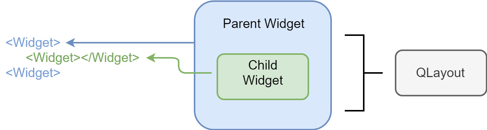

## 实现嵌套和布局

我们已经可以成功渲染一个组件了，这是一个非常大的进展。但是如果我想要将组件嵌套起来呢？用现在的代码虽然 JSX 可以这么写，但实际效果不会有什么卵用，两个 Widget 只会分别变成两个窗口。

```jsx
// 如果我们要实现这样的嵌套，该怎么做呢？
class Example extends Component {

  render() {
    return (
      <Widget>
        <Widget></Widget>
      </Widget>
    );
  }
}
```

为什么会这样呢？原因是我们的实际 GUI 程序是 Qt 所渲染的，而 Qt 有他自己的一套规则来进行嵌套。要使用 Qt 的嵌套，就必须了解一下 Qt 的布局系统。

Qt 的布局主要依靠`QLayout`的各种子类来实现，比较常用的是`QVBoxLayout`和`QHBoxLayout`。Qt 的这两个布局比较类似于 CSS 的 flex，前者是纵向弹性布局，而后者则是横向水平布局。被布局的组件会自动撑满父组件，如果需要拉伸或压缩，则各子组件会均匀分摊。

使用的时候需要父组件设置自己的布局，也就是给父组件设置一个`QLayout`的实例，这样所有子组件就会自动被布局。

那么 Qt 当中如何表达组件之间的“父子关系”呢？Qt 的所有GUI组件都继承自`QWidget`，而`QWidget`又继承自`QObject`。`QObject`提供了一个方法`setParent`，通过这个方法，Qt 就能够将组件之间的父子关系建立起来。在 Qt 中，对象的父子关系不仅会用于布局，同时也会应用在对象的“垃圾回收”上，感兴趣的话，大家可以自己在官方文档中看一下。



对于我们来说，要桥接 Qt 的布局系统，其实只需要做两件事：

1. 在原生模块当中，我们需要暴露出组件设置布局和建立组件父子关系的方法
2. 在 JS 代码当中，我们需要在组件加入组件树的时候，调用原生代码建立父子关系；同时在组件移除出组件树的时候，解开原生组件的父子关系

原生代码的核心改动：

```cpp
// 加在BasicWidget中，因为我们希望每个组件都有这个方法
static NAN_METHOD(SetParent) {
  BasicWidget *obj = Nan::ObjectWrap::Unwrap<BasicWidget>(info.Holder());
  BasicWidget *parent = Nan::ObjectWrap::Unwrap<BasicWidget>(info[0]->ToObject());
  obj->widget_->setParent(parent->getWidget());
}
```

另一方面，我选择在reconciler中直接加入设置父子关系的代码：

```javascript
appendInitialChild(parentInstance, child) {
  if (parentInstance.appendChild) {
    parentInstance.appendChild(child);
    // 处理父子关系
    if (child.widget && parentInstance.widget) {
     child.widget.setParent(parentInstance.widget);
    }
  } else {
    parentInstance.document = child;
  }
},
```

加完这段我发现其实不止一个地方涉及到父子关系处理，索性把父子关系相关的代码拆成了两个独立函数：

```javascript
function attachParentInQt(parent, child) {
  console.log('attachParentInQt');
  if (child.widget && parent.widget) {
    child.widget.setParent(parent.widget);
  }
}

function detachParentInQt(child) {
  console.log('detachParentInQt');
  if (child.widget) {
    child.widget.clearParent();
  }
}
```

现在来处理QLayout:


```cpp
// basic-widget.hpp
static NAN_METHOD(SetLayout) {
  // info[0]指的是第0个参数
  // 这里偷了个懒，用数字类型来表示布局到底是水平还是竖直
  if (!info[0]->IsInt32()) {
    Nan::ThrowError("Layout must be int.");
    return;
  }
  BasicWidget *obj = Nan::ObjectWrap::Unwrap<BasicWidget>(info.Holder());
  const int layoutId = info[0]->Int32Value();
  QLayout *layout = nullptr;

  // C++当中，父类类型的指针，可以存放子类的实例
  // 这是C++多态的一种表现
  switch (layoutId) {
  case 1:
    layout = new QVBoxLayout;
    break;
  case 2:
    layout = new QHBoxLayout;
    break;
  }
  auto oldLayout = obj->getWidget()->layout();
  obj->getWidget()->setLayout(layout);
  // 旧的实例需要手动清理
  if (oldLayout) {
    delete oldLayout;
    oldLayout = nullptr;
  }
}
```

JS这一侧的改动更小一些。主要是`Widget.js`里，在容器创建时，就根据`layout`属性来设置布局。另一方面，由于有了`layout`属性，那么就必须注意观察属性的变化。

```javascript
// 这是Widget的构造函数
constructor(root, props) {
  super(root, props);
  this.root = root;
  this.props = {
    ...Widget.defaultProps,
    ...props,
  };
  this.widget = createWidget();
  // 这里增加调用布局设置
  this.widget.setLayout(this.props.layout);
}

// 同时，组件的属性变化时，我们要能够及时反映在Qt系统里
update(oldProps, newProps) {
  if (newProps.layout !== oldProps.layout) {
    this.widget.setLayout(newProps.layout);
  }
}
```

现在我们的React代码就可以成功地进行嵌套了。不过如果仅仅是 QWidget，那么即使嵌套也看不出什么效果，顶多是窗口数量从2变成了1。下一节我们来看看如何量产一些其他的组件。
