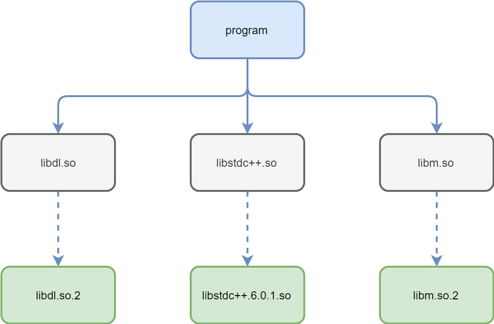
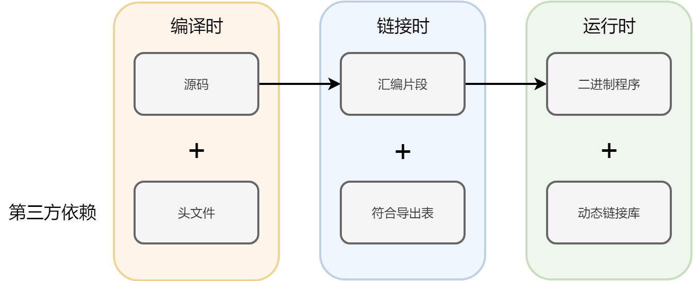

### 关键的链接

Qt 是一个 C++ 的跨平台 UI 框架。要使用 Qt 的 UI 组件，首先要实现的就是，通过原生模块调起 Qt。

在 C++ 的世界里，模块的概念比较模糊，大家一般是采用动态链接库的形式来进行模块复用的。什么是动态链接库呢，在 Windows 上，形形色色的`xxx.dll`就是动态链接库。在 macOS 和 Linux 上，也各自有自己的动态链接库，比如`xxx.dylib`和`xxx.so`。

熟悉 Node.js 的朋友要问了，动态链接库是怎么工作的，和 npm 模块是什么区别？

动态链接库这个东西，其实是一组函数的封装，里面装的是二进制代码。它是一种特殊的可执行程序，特殊在哪呢？普通的可执行程序的入口点在`main`函数上，因此操作系统的 shell 知道如何唤起，但动态链接库则通常没有固定的入口点，它完全是开发者自己约定的，因此无法通过类似双击的形式执行。

这样的可执行程序，主要是用来存放需要共享的代码，操作系统中同一个动态链接库通常只需要在内存中驻留一份。只要不主动更改动态链接库的接口，那么它就可以被无缝地更新。Linux 上常用的一种做法就是对于`libstdc++.6.so`这样的库，不直接进行引用，而是再创建一个软连接，比如`libstdc++.so`，这样如果更新到了`libstdc++.6.0.1.so`，只需要修改软连接即可，而库本身因为不修改接口，因此依然可用。这种接口不变的机制，是二进制兼容性（binary compatibility）的根本。



Qt和其他C++库一样，发行时会携带若干动态链接库。如果要想调用Qt的功能，虽然Qt官方做了非常多的外围工作，例如提供 moc、qmake 之类的工具，但实际只需要正确地链接好Qt的动态链接库即可。

在C++世界里，编译器本身只是套件当中我们最熟知的一个部分，它负责把人类的代码变成机器码。如果一个C++工程当中有4个cpp文件，那么一般会产生4个对应的机器码文件。而最终将这4个机器码文件合并起来的，则是链接器。不同的编译器，实际会有不同的编译套件。Windows 开发者比较熟悉的 vc++，对应的链接器实际是`link.exe`；而 gcc 则对应的链接器是`ld`；到了 LLVM 平台，就是`lld`了。

链接动态链接库的过程，也是由链接器来负责的。如果编译器明确知道你要调用的函数来自于某个动态链接库，而不是你自己的代码，那么编译时就会将这个符号对应的实体预留下来，到了链接期，链接器会在系统中查找对应的库。在 Node.js 原生模块的编译体系里，链接什么样的库，可以写在 gyp 文件当中。

关键环节如下：

```javascript
"include_dirs": [
  "<!(node -e \"require('nan')\")",
  "D:/Qt/5.10.0/msvc2017_64/include/",
  "D:/Qt/5.10.0/msvc2017_64/include/QtCore"
],
```

```javascript
"link_settings": {
  "libraries": [
    "D:/Qt/5.10.0/msvc2017_64/lib/Qt5Core.lib"
  ],
},
```

这里这个选项将会告诉链接器，我最终需要链接`Qt5Core.dll`这个库。

这里稍微说一下链接都需要什么。链接器进行链接的过程，最关键的是一个查找符号的过程。所谓符号，在这里就是我们需要调用的函数。编译器在工作时，为了能将符号确定下来，就需要相应的头文件。而链接器在链接时，为了能找到对应的符号，则需要一个“符号导出表”，这个表在 Windows 平台当中，常被写作`.lib`文件。一旦链接完成，运行程序时，系统则会去找对应的`.dll`文件了。



因此，整个过程的顺利完成，需要头文件、lib文件和dll文件，三者缺一不可。

上面的gyp文件改动，我们增加了头文件和lib文件的查找范围。而对于`dll`文件，因为是运行时查找，因此不需要我们提供给 gyp ，只需要我们在运行 Node.js 之前，把对应的文件放在系统的默认查找位置上即可。

### 初试Qt

Qt当中功能非常多，如果我只是想验证一下调用 Qt 的能力，那么选择一个比较基础的功能即可。我选择的是调用`QString`相关的方法。

关键代码：

```cpp
static NAN_METHOD(GetValue) {
  Hello* obj = ObjectWrap::Unwrap<Hello>(info.Holder());
  QString str = QString("%1 wants to be %2.").arg("Trump", "the president");
  auto bytes = str.toUtf8();
  auto v8Str = Nan::New<v8::String>(bytes.data()).ToLocalChecked();
  info.GetReturnValue().Set(v8Str);
}
```
其中`QString`就是 Qt 的私货了，我在这创建了一个实例，然后使用了插值，并将结果转化成了 V8 自己的字符串格式，最后作为了`getValue()`的返回值。

`QString`的定义主要放在`QString`头文件中，因此`addon.cc`的顶端我还增加了这个头文件：

```cpp
#include <QString>
```

在Qt中，绝大部分类名都有自己对应的头文件。

现在，只要将`Qt5Core.dll`复制到`index.js`的旁边，就可以用`node index.js`调起整个程序了，其输出应该如下：

```
hello, Trump wants to be President.
```
