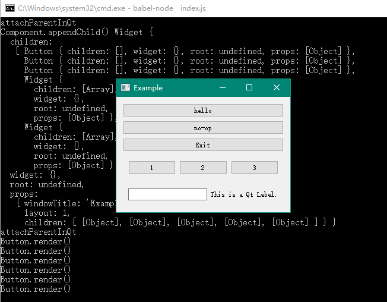

## 量产组件

为了更好地看到效果，我决定批量生成一些组件。首先来回顾一下，要生成一个组件，我都要修改哪些文件：

* 新建一个`xxx.hpp`，以便将原生代码和 V8 连接起来
* 新建一个`xxx.js`，以便在 React 中有相应的组件
* 在`createElement`中的组件映射表中增加新的组件名称映射，以便在 JSX 中可以使用

这里面工作量最大的部分，就是第一步。为了让第一步好受一些，我决定写一个脚本来自动生成原生代码。

通常一个 Qt 的 Widget 会有很多方法，但绝大部分方法的参数、返回值，都集中在数字、字符串和布尔值上，所以我可以用一个通用的格式来描述组件：

```javascript
{
  widgetName: 'Button',
  widgetQtName: 'QPushButton',
  methods: [
    {
      name: 'show',
      type: 'getter',
      ret: 'null',
    },
    {
      name: 'text',
      type: 'getter',
      ret: 'string',
    },
    {
      name: 'setText',
      type: 'setter',
      args: ['string'],
    },
    {
      name: 'clicked',
      type: 'setter',
      args: ['callback'],
    },
  ],
}
```

这里面其他的都好说，大家看一眼`qt/wrapper-generator.js`和`qt/partial.js`的内容也就明白了，唯独 Qt 有个信号槽机制，需要我们单独处理一下。

## Qt的信号槽

如果我点了一个按钮，希望触发一些操作，比如弹个框什么的，该怎么做呢？常见的 GUI 原生库一般有两种套路。第一种是通过消息机制，我记得 win32 最早的编程就是这么搞的，写个巨大的`switch case`语句，然后过滤消息，根据不同的消息来做处理；第二种是通过回调函数，这个就和浏览器的 API 差不多，宝蓝公司的 VCL 走的是这个套路。

Qt 呢，两个套路都有，而且在套路之外，用信号槽机制来包装了一层。举个例子：

```cpp
QObject::connect(&a, &Counter::valueChanged,
                 &b, &Counter::setValue);
```

这句代码将`a`对象的`valueChanged`信号对接到了`b`对象的`setValue`槽上，于是当`valueChanged`被触发时，`setValue`会自动调用，且被调用的参数就是`valueChanged`的参数。

信号槽当中一个信号可以连接多个槽，而一个槽也可以被多个信号触发。这个神奇的机制完成了一个“观察者模式”，其本质是Qt的元编程工具`moc`帮我们进行了自动调用。


有些小伙伴可能不理解，如果我有消息机制和回调函数，为什么还要费周折去搞这一套呢？这里面有两个原因，一方面是消息机制往往需要编写额外的代码来衔接事件，很难做到优雅；另一方面，用回调函数的话，一旦牵扯到跨线程调用，竞态是很难发现和避免的。Qt 的这个自动连接，可以在跨线程时变为按消息传递，避免了直接调用回调函数的尴尬。有兴趣的话，大家可以在 Qt 的[官方文档](https://doc.qt.io/qt-5/signalsandslots.html)中查看详情。

回到正题，Qt 的各类 GUI 组件，也是通过信号槽机制来衔接的。以`QPushButton`这个按钮组件来说，`QPushButton::clicked`就是一个信号函数。这个信号函数在按钮被点击时，会被 Qt 自动调用，随之也就会调用连接着这个信号的所有槽函数。JavaScript 当中我们比较熟悉的机制是回调函数，那么不如让我们的回调函数成为槽函数，这样就可以实现点击响应了。

我在代码生成脚本中为每个信号函数生成了一个能够挂载槽函数的函数，会生成出这样的原生代码：

```cpp
static NAN_METHOD(Clicked) {
  Button* obj = ObjectWrap::Unwrap<Button>(info.Holder());
  if (info.Length() < 1) {
    Nan::ThrowError("Lack of callback.");
    return;
  }
  if (!info[0]->IsFunction()) {
    Nan::ThrowError("Callback must be function.");
    return;
  }
  v8::CopyablePersistentTraits<v8::Value>::CopyablePersistent p;
  p.Reset<v8::Value>(v8::Isolate::GetCurrent(), info[0]); //< Isolate required

  // 挂载一个匿名函数，匿名函数内部调用实际的 JavaScript 回调
  QObject::connect(((QPushButton *)obj->getWidget()), &QPushButton::clicked, [p] () {
    v8::Local<v8::Value> v = Nan::New(p);
    Nan::Callback cb;
    cb.Reset(v.As<v8::Function>());
    cb.Call(0, 0);
  });
}
`;
```

有了这样的代码，我就可以在 JS 对应的组件这边挂载回调了：

```javascript
// 注意这个clicked
<Button key={1} text={this.state.buttonText} clicked={this.incCounter.bind(this)}></Button>
```

好了，现在我们可以批量造一些简单的组件了。实际效果：

```javascript
<Widget layout={1} windowTitle="Example">
  <Button key={1} text={this.state.buttonText} clicked={this.incCounter.bind(this)}></Button>
  <Button key={2} text={"no-op"}></Button>
  <Button key={3} text={"Exit"} clicked={stopUiLoop}></Button>
  <Widget layout={2}>
    <Button key={4} text={"1"}></Button>
    <Button key={5} text={"2"}></Button>
    <Button key={6} text={"3"}></Button>
  </Widget>
  <Widget layout={2}>
    <Input text="" returnPressed={this.applyInputContent.bind(this)} />
    <Label text="This is a Qt Label." />
  </Widget>
</Widget>
```

效果如图：



上面的运行结果是基于 Windows 平台的，那么如果我想要支持 macOS 呢？下一节我们来稍微调整一下`gyp`文件，支持跨平台。
