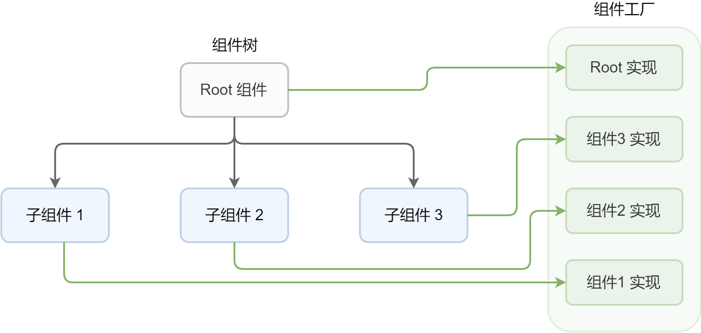
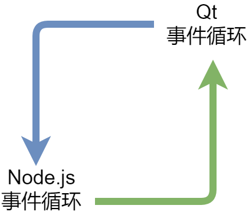

## 再说React

前面铺垫了两节背景知识，现在终于到了 React 了。

为了方便指明，我把 React 渲染到最终目标的部分称作渲染器。

早期做一个渲染器不是很容易，需要和特定的 React 版本强绑定，但到了最近几个版本，似乎已经基本有了定式。

做一个渲染器最重要的部分，就是要实现一个 React 的 reconciler。现在 npm 上已经有了非常容易用的 reconciler 的工厂，叫做 [react-reconciler](https://www.npmjs.com/package/react-reconciler)。

这个包的用法非常简单，就是给它提供足够多的函数，它就可以帮你把 reconciler 生成出来。具体需要写哪些方法，可以看一下[这篇 Making a custom React renderer](https://github.com/nitin42/Making-a-custom-React-renderer/blob/master/part-one.md)，不过我自己在实践的时候，发现还缺了几个方法，各位可以看一眼仓库里的react/reconciler.js，我已经给补上了。

### 渲染器的模式

React 的渲染器一般有几个经典部分组成，除了刚才说到的 reconciler，还有几个部分，分别是主 render 函数、Root 组件、组件工厂。

用户使用 React 的时候，最直接接触到的是主 render 函数，比如`ReacDOM.render`就是 Web 版渲染器的主 render 函数。

Root 组件就好比是 HTML 中的 body，所有其他的组件都会在它的内部。由于是整个渲染树的最根部，初始化的时候会和其他组件略有不同，所以这个 Root 组件一般不会让用户去创建，而是交给 render 函数内部去自动做了。

剩下的组件工厂，也很简单。大家知道 React 写 JSX 的时候，写的都是标签名或者说是叫组件名，那么 React 拿着这个组件名称要去创建组件的时候，必然需要寻找到它对应的组件构造函数或者是工厂函数。组件工厂的作用就在这里了，它起到了一个映射表的作用。



所以，React 渲染器的渲染过程就可以概括成下面这样：

用户调起 render 函数，而 render 函数内部则通过组件工厂创建出 Root 组件，把它交给生成好的 reconciler，最后进入 React 的正常组件生命周期。

### 两个事件循环

渲染器的流程理清楚之后，就可以开始思考怎么把 Qt 融入到其中了。

Qt 的 GUI 实现和主流桌面 GUI 库没有太大区别，大体来说，就是主线程会开启一个事件循环，处理操作系统和用户产生的各种事件，根据事件来在屏幕上画出相应的内容。

在纯Qt程序里，这个主线程会被 Qt 的事件循环给占住，但是我们的原生模块运行在Node.js当中，如果把 node 的主线程给占住了，那整个 JS 执行环境就会停住。

如果贸然将其中一个循环挪到另一个线程中，就将会面临线程安全的挑战。作为一个 C++ 小白，我觉得这不是我想要的。

好在 Qt 还提供了类似于“步进”的处理模式，每调用一次只处理一批事件，处理完了之后就不会占住主线程了。有了这个方法就好办了，我只需要用`setInterval`周期性地去调用，就可以在不破坏 Node.js 事件循环的前提下，同时进行 Qt 的事件循环了。



另一方面，渲染器的 Root 组件是整个组件树的起点，Qt 事件循环的开始，完全可以放在 Root 组件的初始化当中。

### 衔接 Qt 组件

各位还记得最开始给出的一大长段原生模块代码么，现在我们要用它来提供Qt组件。

在Qt当中，组件可能有上百个，要从哪开始呢？

`QWidget`是所有 Qt GUI 组件的基类，如果单独实例化一个`QWidget`，那么它就是一个空窗口。为了验证我们是否能正常衔接 Qt，我决定就用它来做第一个组件。

```cpp
#include <nan.h>
#include <QWidget>

// 这个class中未来会封装一些通用功能
class BasicWidget;

class Widget : public BasicWidget {
  public:
  static NAN_MODULE_INIT(Init) {
    v8::Local<v8::FunctionTemplate> tpl = Nan::New<v8::FunctionTemplate>(New);
    tpl->InstanceTemplate()->SetInternalFieldCount(6);

    Nan::SetPrototypeMethod(tpl, "show", Show);

    constructor().Reset(Nan::GetFunction(tpl).ToLocalChecked());
  }

  static NAN_METHOD(NewInstance) {
    v8::Local<v8::Function> cons = Nan::New(constructor());
    info.GetReturnValue().Set(Nan::NewInstance(cons).ToLocalChecked());
  }

 private:
  explicit Widget() : BasicWidget(new QWidget) {}
  ~Widget() {}

  static NAN_METHOD(New) {
    if (info.IsConstructCall()) {
      Widget * obj = new Widget();
      obj->Wrap(info.This());
      info.GetReturnValue().Set(info.This());
    } else {
      v8::Local<v8::Function> cons = Nan::New(constructor());
      info.GetReturnValue().Set(Nan::NewInstance(cons).ToLocalChecked());
    }
  }

  static NAN_METHOD(Show) {
    Widget* obj = ObjectWrap::Unwrap<Widget>(info.Holder());
    // getWidget是BasicWidget的方法，我们用它来获取实例中存放的QWidget实例
    ((QWidget *)obj->getWidget())->show();
  }

  static inline Nan::Persistent<v8::Function> & constructor() {
    static Nan::Persistent<v8::Function> my_constructor;
    return my_constructor;
  }

};
```

这段代码和最开始的原生模块代码没有太大区别。这里我给`Widget`挂了一个方法，叫`Show`，因为我们需要这个方法来告诉Qt，我们需要`QWidget`显示出来。

在JS一侧：

```javascript
class Widget extends Component {
  children = [];
  widget = null;

  constructor(root, props) {
    super(root, props);
    this.root = root;
    this.props = {
      ...props,
    };
    // 调用原生模块中的方法来创建组件
    this.widget = createWidget();
  }

  render(parent) {
    this.renderChildren(this);
    // 在组件渲染时通知Qt显示对应的`QWidget`
    this.widget.show();
  }
}
```

这个`Widget`类实例化出的对象，和`QWidget`的实例是一一对应的，我们需要做的就是把两边的方法桥接起来。

至此，我们已经可以成功地展示出一个 Qt 组件了：

```jsx
class Example extends Component {

  render() {
    return (
      <Widget></Widget>
    );
  }
}

render(<Example/>);
```
